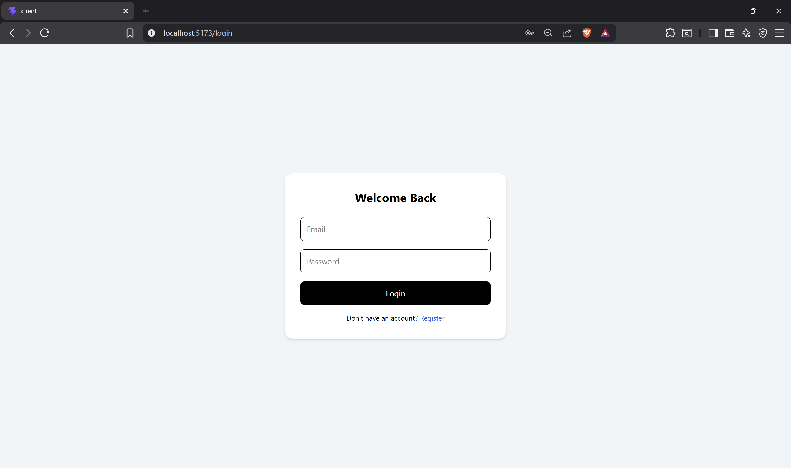
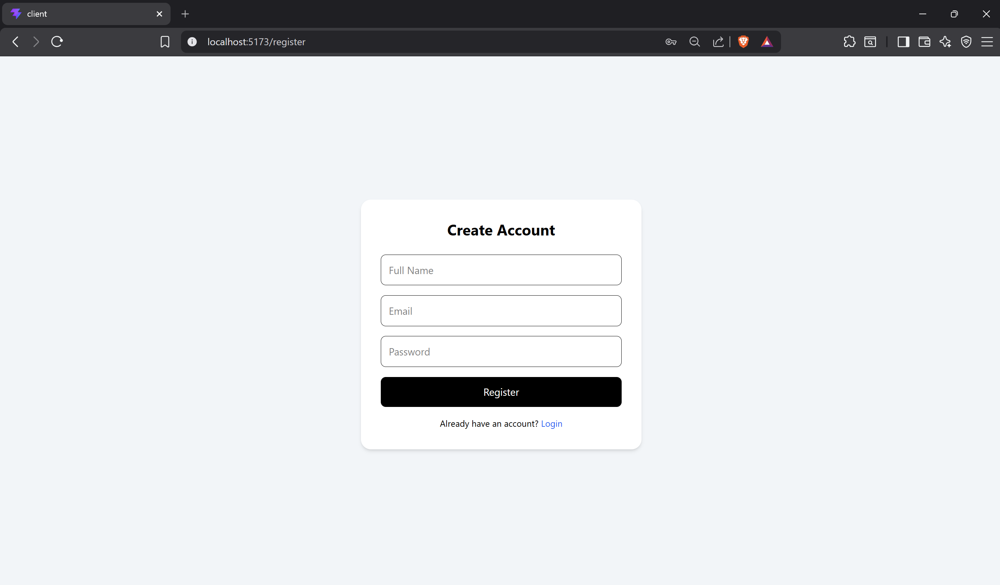
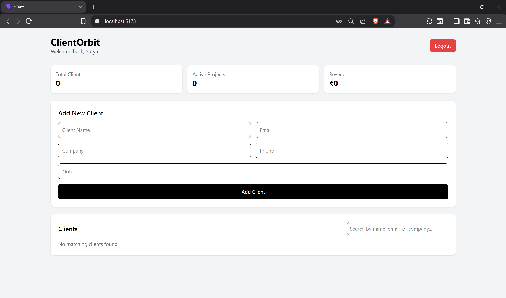
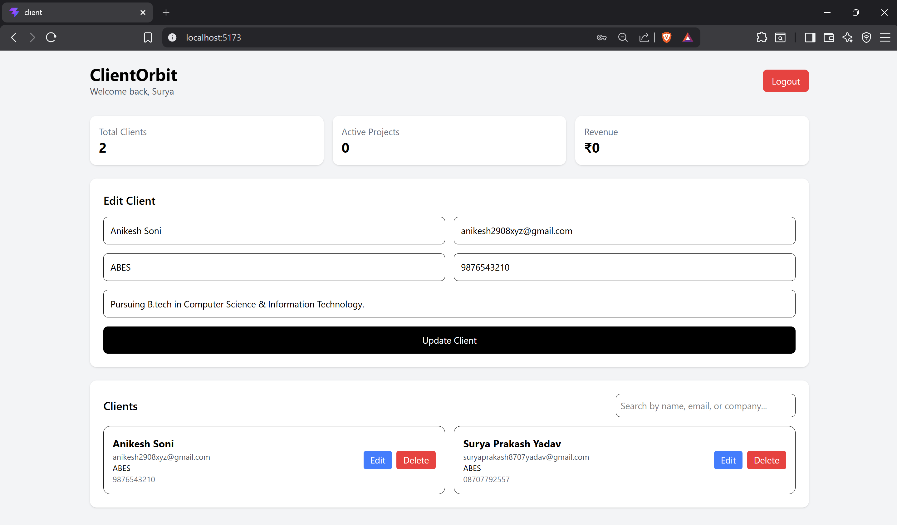

# 🚀 ClientOrbit – Freelancer CRM SaaS

ClientOrbit is a **MERN Stack Freelancer CRM SaaS** built to help freelancers manage their **clients, communication, and workflow** in one place.

It is designed as a **portfolio-ready SaaS project** with authentication, protected routes, client management, search, and a clean dashboard UI.

---

## ✨ Features

### 🔐 Authentication
- User Registration
- User Login
- JWT Authentication
- Protected Routes
- Logout

### 👥 Client Management
- Add Client
- View All Clients
- Edit Client
- Delete Client
- Search Clients

### 🎨 UI / UX
- Modern SaaS-style Dashboard
- Responsive Layout
- Toast Notifications
- Delete Confirmation
- Clean Card-based UI

---

## 🛠️ Tech Stack

### Frontend
- React.js
- Vite
- Tailwind CSS
- React Router DOM
- Axios
- React Hot Toast

### Backend
- Node.js
- Express.js
- MongoDB Atlas
- Mongoose
- JWT
- bcryptjs
- dotenv
- cors

---

## 📂 Project Structure

```bash
ClientOrbit-Freelancer-CRM-SaaS/
│
├── client/                     # Frontend (React + Vite)
│   ├── src/
│   │   ├── components/
│   │   ├── context/
│   │   ├── pages/
│   │   ├── services/
│   │   ├── App.jsx
│   │   └── main.jsx
│
├── server/                     # Backend (Node + Express)
│   ├── config/
│   ├── controllers/
│   ├── middleware/
│   ├── models/
│   ├── routes/
│   ├── server.js
│   └── .env
│
└── README.md
```

---

## ⚙️ Installation & Setup

### 1️⃣ Clone the repository

```bash
git clone https://github.com/Surya4785/ClientOrbit-Freelancer-CRM-SaaS.git
cd ClientOrbit-Freelancer-CRM-SaaS
```

---

## 🔹 Backend Setup

```bash
cd server
npm install
```

### Create `.env` file inside `server/`

```env
PORT=5000
MONGO_URI=your_mongodb_connection_string
JWT_SECRET=your_secret_key
```

### Run backend

```bash
npm run dev
```

Backend will run on:

```bash
http://localhost:5000
```

---

## 🔹 Frontend Setup

```bash
cd client
npm install
npm run dev
```

Frontend will run on:

```bash
http://localhost:5173
```

---

## 🔑 API Endpoints

### Auth Routes
- `POST /api/auth/register` → Register user
- `POST /api/auth/login` → Login user
- `GET /api/auth/profile` → Get logged-in user profile

### Client Routes
- `GET /api/clients` → Get all clients
- `POST /api/clients` → Add new client
- `PUT /api/clients/:id` → Update client
- `DELETE /api/clients/:id` → Delete client

> Protected routes require JWT token in Authorization header.

---

## 📸 Screenshots

### 🔐 Login Page


### 📝 Register Page


### 📊 Dashboard


### ✏️ Edit Client


---

## 🚀 Future Improvements

- Invoice Management
- Payment Tracking
- Project Status Module
- Deadline Reminders
- Analytics Dashboard
- Role-based Access
- Deployment (Vercel + Render)

---

## 👨‍💻 Author

**Surya Prakash Yadav**  
GitHub: [@Surya4785](https://github.com/Surya4785)

---

## ⭐ If you like this project
Give it a **star** on GitHub ⭐